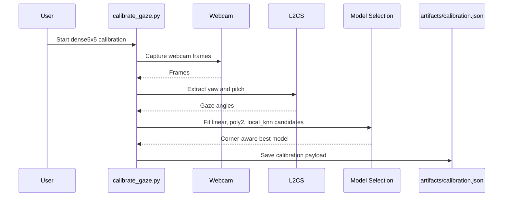
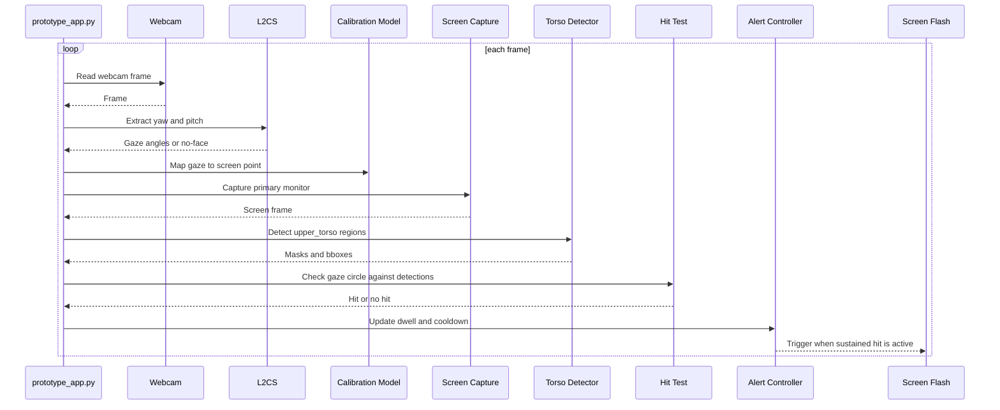

# Live Gaze + Torso Trigger Prototype

Windows-first local prototype for calibrated webcam gaze, live screen capture, torso-region detection, and optional visual flash triggering.

The shipped surface is intentionally narrow:

- Gaze backend: `L2CS` only
- Recommended calibration: `dense5x5`
- Runtime detector: `models/body_regions_yolov8s_seg.pt`
- Runtime target: `upper_torso`
- Flash modes: `overlay` and `white`

This repo does not save screenshots, webcam frames, screen frames, or video during normal operation.

## Runtime Summary

At runtime the app:

1. reads a webcam frame
2. runs L2CS to estimate gaze angles
3. maps gaze angles to screen coordinates using the saved calibration model
4. captures the current primary monitor
5. runs the custom body-region segmentation model
6. checks whether the gaze circle intersects an `upper_torso` mask or fallback bbox
7. applies dwell and cooldown logic
8. optionally triggers a screen flash

## Requirements

- Windows
- Python 3.11 virtual environment
- Webcam
- CUDA-enabled PyTorch is recommended but not required
- Existing trained torso model at:

```text
D:\BDAFINAL\Experiments\models\body_regions_yolov8s_seg.pt
```

## Setup

```powershell
cd D:\BDAFINAL\Experiments
py -3.11 -m venv .venv
.\.venv\Scripts\python.exe -m pip install -r requirements.txt
.\.venv\Scripts\python.exe download_models.py
```

`download_models.py` does two things:

- normalizes or downloads `models\L2CSNet_gaze360.pkl`
- verifies that `models\body_regions_yolov8s_seg.pt` already exists

It does not retrain or fetch the custom torso model.

## Models Used at Runtime

Required runtime assets:

```text
models/L2CSNet_gaze360.pkl
models/body_regions_yolov8s_seg.pt
```

Runtime only uses the custom torso model and only triggers on `upper_torso`.

## Calibration

Recommended calibration command:

```powershell
cd D:\BDAFINAL\Experiments
.\.venv\Scripts\python.exe calibrate_gaze.py --profile dense5x5 --model auto
```

This is the recommended operator path even though `dense5x5` is already the config default. Being explicit avoids ambiguity.

Fast diagnostic calibration:

```powershell
.\.venv\Scripts\python.exe calibrate_gaze.py --profile standard3x3 --model auto
```

Supported calibration models:

- `auto`
- `l2cs_angle_linear`
- `l2cs_angle_poly2`
- `l2cs_local_knn`

Recommended default is `auto`.

Calibration writes:

```text
artifacts/calibration.json
artifacts/calibration_diagnostics.json
```

Important behavior:

- `dense5x5` uses a 5x5 grid plus a 4-corner refinement pass
- dense-profile `auto` is corner-aware
- no images or video are written during calibration

## Runtime

Runtime is webcam-only. `--webcam` is still accepted as a compatibility flag, and the examples below keep it.

Run without flash:

```powershell
cd D:\BDAFINAL\Experiments
.\.venv\Scripts\python.exe prototype_app.py --webcam
```

Run with semi-transparent overlay flash:

```powershell
.\.venv\Scripts\python.exe prototype_app.py --webcam --screen-flash --screen-flash-mode overlay
```

Run with opaque full-screen white flash:

```powershell
.\.venv\Scripts\python.exe prototype_app.py --webcam --screen-flash --screen-flash-mode white
```

Current trigger parameters:

- gaze hit radius: `70px`
- detection geometry scale: `1.05`
- dwell: `350ms`
- flash duration: `2000ms`
- cooldown: `500ms`

## Runtime Behavior Notes

- Only `upper_torso` participates in trigger logic.
- The app prefers mask hits and falls back to bbox hits only when needed.
- If no face is visible to the webcam, runtime falls back to screen center with `confidence = 0.0`.
- That fallback keeps the loop alive but suppresses hits, dwell, flash, and alert activation.

## Sequence Diagrams

### Calibration Flow



### Runtime Flow



## Artifacts and Logs

Main artifacts:

```text
artifacts/calibration.json
artifacts/calibration_diagnostics.json
artifacts/events.jsonl
artifacts/gaze_diagnostics.jsonl
```

These store only numeric metadata and runtime state. They do not store image data.

## Troubleshooting

### Calibration finishes but corners are weak

Use dense calibration:

```powershell
.\.venv\Scripts\python.exe calibrate_gaze.py --profile dense5x5 --model auto
```

Then inspect:

```text
artifacts/calibration_diagnostics.json
```

Look at:

- selected model
- validation average error
- per-point errors
- corner behavior

### App crashes when you move out of webcam view

That path is now handled. The runtime should fall back to center with zero confidence instead of crashing.

### Flash does not trigger

Check the preview status text:

- `hit` means a torso intersection exists
- `dwell:x/350ms` means dwell is still accumulating
- flash only triggers after dwell becomes active

### GPU is not being used

Check Torch:

```powershell
.\.venv\Scripts\python.exe -B -c "import torch; print(torch.__version__); print(torch.cuda.is_available()); print(torch.version.cuda)"
```

If `torch.cuda.is_available()` is `False`, the venv is still using a CPU-only Torch build.

## Advanced: Retraining the Torso Model

Runtime does not depend on the training package.

If retraining is needed, use the separate Turing workflow and then copy the exported model back to:

```text
models/body_regions_yolov8s_seg.pt
```

Treat retraining as an advanced maintenance task, not part of normal operator usage.
